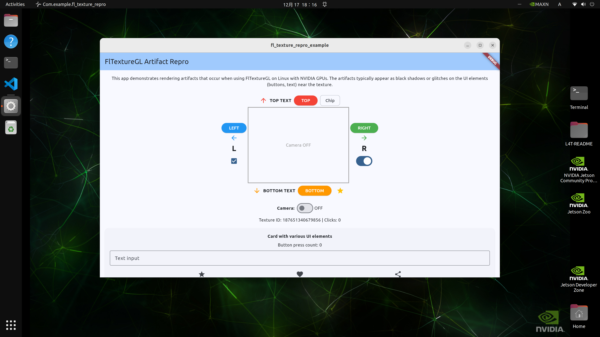
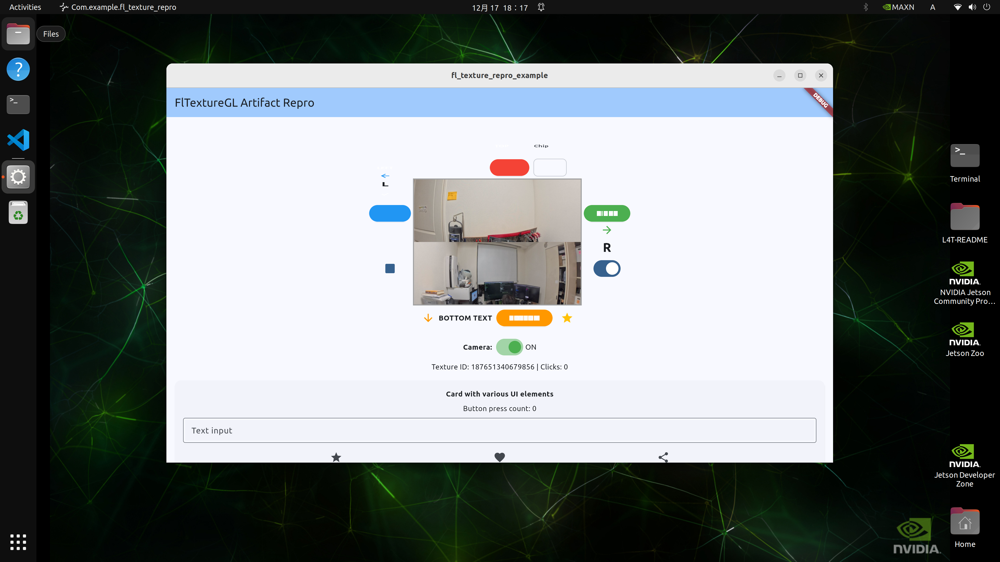

# FlTextureGL Rendering Artifact Reproduction

This is a minimal reproduction project for [Flutter Issue #179322](https://github.com/flutter/flutter/issues/179322).

## Problem

When using `FlTextureGL` on Linux with NVIDIA GPUs, UI elements (buttons, text, icons) near the texture display rendering artifacts - elements disappear or show visual glitches.

## Screenshots

### Camera OFF - All UI elements render correctly


### Camera ON - UI elements disappear (artifacts)


**Observed artifacts when camera is ON:**
- Text labels (TOP TEXT, BOTTOM TEXT, L, R) disappear
- Icons (arrows, star, checkbox) disappear
- Chip widget disappears
- Only colored buttons remain visible

## Root Cause

The OpenGL texture binding state (`GL_TEXTURE_BINDING_2D`) is modified during texture population but not restored afterwards. This causes Skia to render with an unexpected texture bound, resulting in visual artifacts.

Specifically, in `fl_engine_gl_external_texture_frame_callback`, the `populate` callback modifies GL state without notifying Skia via `GrDirectContext::resetContext()`.

## Reproduction Environment

- **Device**: NVIDIA Jetson Orin NX 16GB
- **OS**: Linux (JetPack / Ubuntu)
- **GPU**: NVIDIA (Tegra)
- **Flutter**: 3.38.1 (stable, latest as of Dec 2025)
- **Camera**: USB camera (tested with Insta360 X5)

## Quick Start

### Prerequisites

```bash
# Install dependencies (Ubuntu/Debian)
sudo apt-get install clang cmake ninja-build pkg-config \
    libgtk-3-dev liblzma-dev libepoxy-dev \
    libgstreamer1.0-dev libgstreamer-plugins-base1.0-dev
```

### Build and Run

```bash
# Clone the repository
git clone https://github.com/hummer98/fl-texture-repro.git
cd fl-texture-repro/example

# Get dependencies
flutter pub get

# Run the app
flutter run -d linux
```

### Using the App

1. The app starts with camera ON by default
2. Observe the UI elements around the camera preview - some will be missing
3. Toggle the "Camera" switch to OFF
4. All UI elements should now be visible
5. Toggle back to ON to see the artifacts reappear

## Expected Behavior

- Texture displays camera feed
- All UI elements (text, icons, buttons) render correctly regardless of texture state

## Actual Behavior

- When texture is active, nearby UI elements disappear or show artifacts
- Text and icons are most affected
- Colored buttons with backgrounds tend to remain visible
- Toggling texture visibility on/off demonstrates the issue clearly

## Technical Details

### GStreamer Pipeline

The plugin uses a GStreamer pipeline to capture camera frames:

```
v4l2src device=/dev/video0 !
image/jpeg,width=1920,height=1080,framerate=30/1 !
jpegdec ! videoscale ! video/x-raw,width=640,height=480 !
videoconvert ! video/x-raw,format=RGBA !
appsink
```

### FlTextureGL Implementation

The `populate` callback in `fl_texture_repro_plugin.cc`:
1. Binds the texture with `glBindTexture(GL_TEXTURE_2D, texture_id)`
2. Uploads frame data with `glTexImage2D()`
3. Sets texture parameters with `glTexParameteri()`
4. **Does NOT restore previous GL state** (intentional to reproduce the bug)

## Proposed Fix

Save and restore `GL_TEXTURE_BINDING_2D` state in Flutter Engine's `fl_engine_gl_external_texture_frame_callback`:

```c
// In flutter-engine/shell/platform/linux/fl_engine.cc

static bool fl_engine_gl_external_texture_frame_callback(...) {
  // Save current texture binding
  GLint previous_texture;
  glGetIntegerv(GL_TEXTURE_BINDING_2D, &previous_texture);

  // ... existing populate callback ...

  // Restore texture binding
  glBindTexture(GL_TEXTURE_2D, previous_texture);

  return result;
}
```

## Project Structure

```
fl_texture_repro/
├── lib/
│   └── fl_texture_repro.dart      # Dart API
├── linux/
│   ├── CMakeLists.txt             # Build config with OpenGL + GStreamer
│   └── fl_texture_repro_plugin.cc # FlTextureGL + GStreamer implementation
├── example/
│   └── lib/main.dart              # Demo app with Texture + UI elements
├── screenshot/
│   ├── camera_off.png             # Screenshot with camera OFF (normal)
│   └── camera_on.png              # Screenshot with camera ON (artifacts)
└── README.md
```

## Related Issues

- [Flutter Issue #179322](https://github.com/flutter/flutter/issues/179322) - This reproduction
- [Flutter Issue #148653](https://github.com/flutter/flutter/issues/148653) - Graphics corruption after OpenGL rendering changes
- [Flutter Issue #152099](https://github.com/flutter/flutter/issues/152099) - NVIDIA/Vivante glBlitFramebuffer disabled
- [Flutter Issue #94622](https://github.com/flutter/flutter/issues/94622) - Dirty region management issues

## References

- [FlTextureGL Documentation](https://api.flutter.dev/flutter/flutter_linux/FlTextureGL-class.html)
- [Skia GrDirectContext::resetContext()](https://api.skia.org/classGrDirectContext.html)
